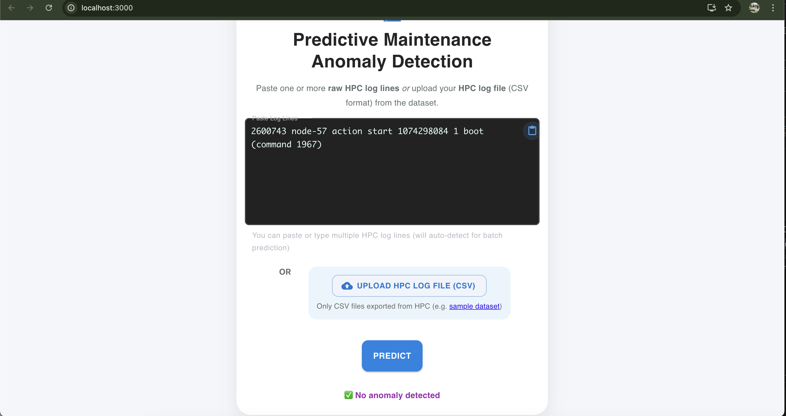
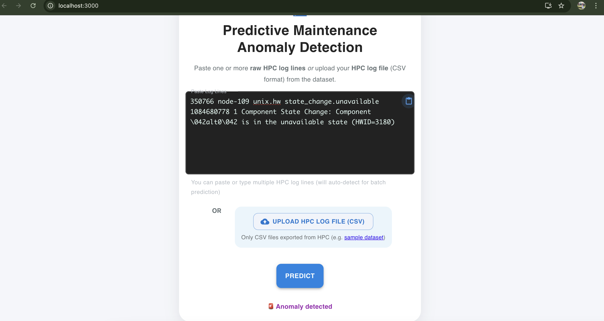

# Predictive Maintenance Anomaly Detection

This project provides an end-to-end workflow for detecting anomalies in HPC system logs. It includes:
- A FastAPI backend that parses raw or structured log lines, encodes features, and serves a trained Random Forest model.
- Feature engineering and re-training scripts to regenerate encoders, datasets, and the model.
- A React frontend for single-line predictions, batch uploads, and quick experimentation.

The pipeline is tailored to the [`HPC_2k.log`](https://github.com/logpai/loghub/blob/master/HPC/HPC_2k.log) dataset and demonstrates how to convert original raw logs into the structured format the model expects.

---

## Project Structure

```
predictive-maintainence/
├─ images/                      # Example UI screenshots
├─ models/                      # Saved Random Forest model + label encoders
├─ public/                      # Minimal HTML form for quick backend checks
├─ raw/data/                    # Dataset artifacts (structured CSV, features, splits)
├─ src/
│  ├─ app.py                    # FastAPI app and inference logic
│  ├─ feature_engineering.py    # Generates encoded features + label encoders
│  ├─ train_test_split.py       # Stratified train/test split
│  ├─ train.py                  # Random Forest training script
│  └─ predictive-frontend/      # React UI (LogForm, BatchUpload, etc.)
└─ requirements.txt             # Python dependencies for the backend
```

---

## Prerequisites

- Python 3.10+ (the bundled virtual environment targets Python 3.12).
- Node.js 18+ for the React frontend.
- `npm` (ships with Node) and `pip` (ships with Python) available on your PATH.

> **Tip:** A ready-to-use `venv/` folder may already exist. You can reuse it or create a fresh virtual environment.

---

## Backend Setup

1. **Create & activate a virtual environment (optional but recommended).**
   ```bash
   python -m venv .venv
   source .venv/bin/activate  # Windows: .venv\Scripts\activate
   ```

2. **Install Python dependencies.**
   ```bash
   pip install --upgrade pip
   pip install -r requirements.txt
   ```

3. **Prepare feature artifacts and train the model (only needed when updating the model).**
   ```bash
   # Regenerate encoded features + label encoders
   python src/feature_engineering.py

   # Produce train/test splits
   python src/train_test_split.py

   # Train the Random Forest model and save it to models/
   python src/train.py
   ```

   This will recreate:
   - `raw/data/hpc_features.csv`
   - `raw/data/X_train.csv`, `raw/data/X_test.csv`, `raw/data/y_train.csv`, `raw/data/y_test.csv`
   - `models/random_forest_model.pkl`
   - `models/label_encoders.pkl`

4. **Run the FastAPI server.**
   ```bash
   uvicorn src.app:app --reload
   ```

   The API exposes:
   - `POST /predict_logline` &rightarrow; accepts a raw or structured log line in JSON (`{"logLine": "..."}`).
   - `POST /predict` &rightarrow; accepts pre-computed feature values in JSON.

   The backend automatically:
   - Parses structured CSV-style lines.
   - Parses raw HPC log lines (space-delimited) by rehydrating `EventId` / `EventTemplate` from the structured dataset; if the content is unseen it falls back to `unknown`.

---

## Frontend Setup

The React application lives in `src/predictive-frontend/`.

1. **Install JavaScript dependencies.**
   ```bash
   cd src/predictive-frontend
   npm install
   ```

2. **Start the development server.**
   ```bash
   npm start
   ```

   This spins up the UI at `http://localhost:3000/` (by default) and communicates with the FastAPI backend at `http://127.0.0.1:8000/`.

3. **Build for production (optional).**
   ```bash
   npm run build
   ```

   The compiled assets land in `src/predictive-frontend/build/`.

---

## Usage

1. **Paste a raw log line** (e.g. from `HPC_2k.log`) into the **Predictive Maintenance Anomaly Detection** textarea and click **Predict**.
   - The backend maps the message to its template and Event ID, encodes features, and returns `1` for anomaly or `0` for normal.
2. **Upload a CSV** (matching the structured schema) using the batch interface to get predictions on multiple rows.
3. **Direct API testing** via `curl`:
   ```bash
   curl -X POST http://127.0.0.1:8000/predict_logline \
     -H "Content-Type: application/json" \
     -d '{"logLine": "319,26281,Interconnect-0T00,switch_module,bcast-error,1124878893,1,Link error on broadcast tree Interconnect-0T00:00:2:1,E22,Link error on broadcast tree Interconnect-<*>:<*>:<*>:<*>"}'
   ```

---

## Example Output

The UI provides immediate visual feedback. Two sample results:





---

## Notes & Tips

- **Raw log parsing:** Only works for messages that appear in the structured dataset used to build the lookup. Unseen messages still get processed but their `EventId`/`EventTemplate` fall back to `unknown`, which may reduce prediction confidence.
- **Model updates:** After modifying feature engineering or adding data, rerun the three Python scripts (`feature_engineering.py`, `train_test_split.py`, `train.py`) to refresh artifacts.
- **Quick sanity checks:** Use `public/index.html` to manually submit feature vectors to `/predict` without running the React app.
- **Troubleshooting:** Ensure both the backend (`uvicorn`) and frontend (`npm start`) processes are running. Watch the backend console for parsing debug statements (enabled in `src/app.py`) when testing new log lines.

---
## License

MIT

## Author

Anubhav Mandarwal ([Anubhav Mandarwal](https://github.com/VrityaCodeRishi))